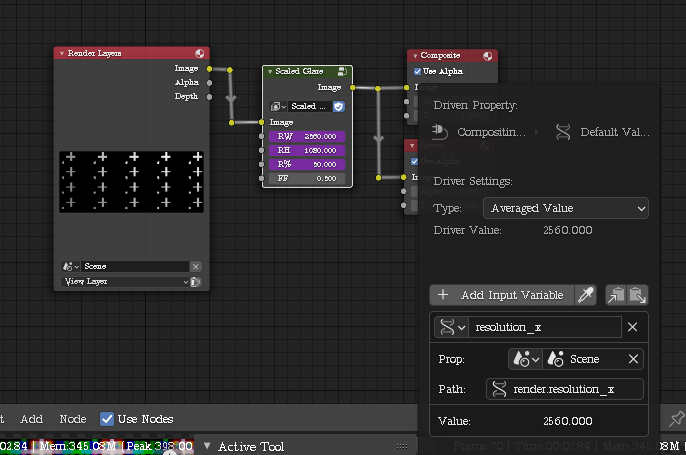
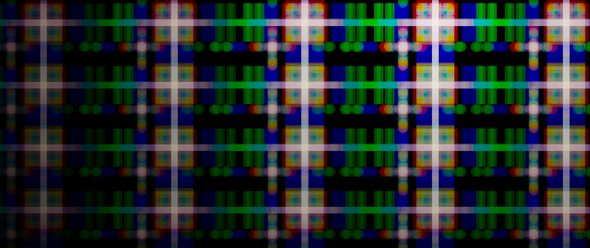
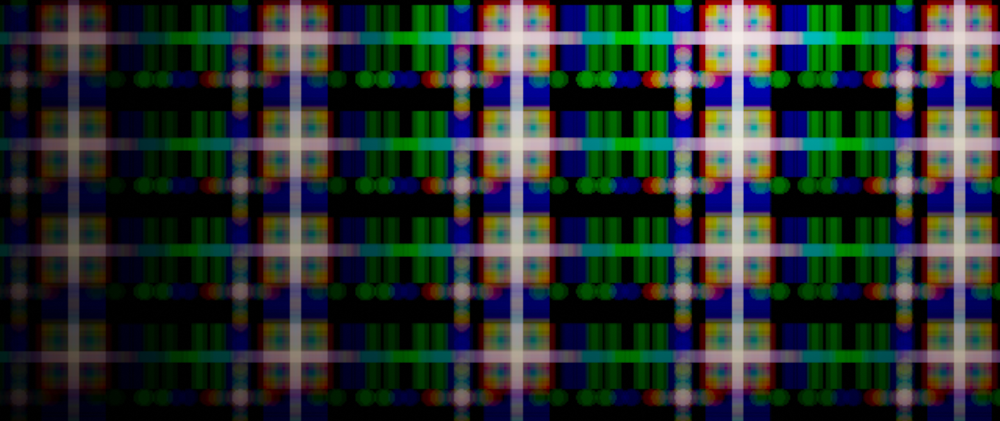

= Glare that can be tweaked so that results are same at different resolution percentages

To use, append, copy resolution and scale as driver and use it to control the nodes inputs.
Unfortunately the glare parameters can't be exported to the node group inputs, so you'll have jump into the group to edit them.

.Driver configuration

.100% resolution

.50% resolution

